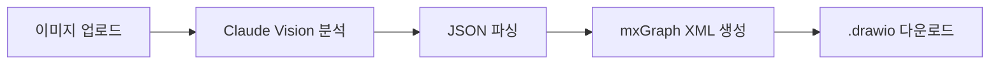

# Event Storming to draw.io Converter

이벤트 스토밍 보드 사진을 `.drawio` 파일로 자동 변환하는 도구입니다. Claude Vision AI가 포스트잇과 연결선을 인식하고, draw.io 호환 XML을 생성합니다.

## 기술 스택

| 기술 | 버전 |
|------|------|
| Java | 17 |
| Spring Boot | 3.4.3 |
| Spring AI (Anthropic) | 1.0.0 |
| Thymeleaf | - |
| Gradle | 8.12 |

## 핵심 흐름

```
이미지 업로드 → Claude Vision 분석 → JSON 파싱 → mxGraph XML 생성 → .drawio 다운로드
```



## 프로젝트 구조 (Hexagonal Architecture)

```
src/main/java/com/eventstorming/drawio/
├── domain/
│   ├── model/          # PostIt, EventStormingBoard, Connection, Position, ColorMapping
│   └── port/
│       ├── in/         # AnalyzeBoardUseCase (Input Port)
│       └── out/        # ImageAnalysisPort (Output Port)
├── application/
│   └── service/        # BoardAnalysisService, ColorMappingService, DrawioXmlGenerator
├── adapter/
│   ├── in/
│   │   ├── web/        # BoardController (REST API)
│   │   └── cli/        # CliAdapter (CLI 실행)
│   └── out/
│       └── ai/         # ClaudeVisionAdapter, ClaudeResponseParser, ClaudePromptBuilder
└── config/             # AnthropicConfig, DefaultColorMappings, GlobalExceptionHandler
```

## 시작하기

### 사전 요구사항

- Java 17+
- Anthropic API Key ([발급받기](https://console.anthropic.com/))

### 빌드

```bash
./gradlew build
```

### 웹 실행

```bash
ANTHROPIC_API_KEY=sk-xxx ./gradlew bootRun
```

브라우저에서 `http://localhost:8080` 접속

### CLI 실행

```bash
java -jar build/libs/event-storming-drawio-0.0.1-SNAPSHOT.jar \
  --spring.profiles.active=cli \
  --image=board.jpg \
  --output=result.drawio \
  --mapping="orange:COMMAND,blue:DOMAIN_EVENT"
```

| 옵션 | 필수 | 설명 |
|------|------|------|
| `--image` | O | 이벤트 스토밍 보드 이미지 경로 (png, jpg, webp) |
| `--output` | X | 출력 파일 경로 (기본값: 이미지명.drawio) |
| `--mapping` | X | 커스텀 색상 매핑 (형식: `color:TYPE,color:TYPE`) |

## API 엔드포인트

| Method | Path | 설명 |
|--------|------|------|
| GET | `/` | 메인 페이지 (이미지 업로드 UI) |
| POST | `/api/analyze` | 이미지 분석 및 drawio XML 생성 |
| GET | `/api/download/{sessionId}` | 생성된 .drawio 파일 다운로드 |
| GET | `/mapping` | 색상 매핑 설정 페이지 |

### POST /api/analyze

- **Parameters**: `image` (MultipartFile), `mappings` (optional JSON string)
- **Response**: `{ sessionId, board, drawioXml, message }`

## 색상 매핑

### 기본 매핑

| 색상 | PostIt 타입 | 설명 |
|------|-------------|------|
| orange (#FF8C00) | DOMAIN_EVENT | 도메인 이벤트 |
| blue (#4A90D9) | COMMAND | 커맨드 |
| yellow (#FFD700) | AGGREGATE | 애그리거트 |
| purple (#9B59B6) | POLICY | 정책 |
| pink (#FF69B4) | EXTERNAL_SYSTEM | 외부 시스템 |
| green (#2ECC71) | READ_MODEL | 읽기 모델 |

### 커스텀 매핑

웹 UI의 `/mapping` 페이지에서 색상별 타입을 변경할 수 있으며, CLI에서는 `--mapping` 옵션으로 지정합니다.

## 테스트

```bash
./gradlew test
```

| 테스트 클래스 | 검증 항목 |
|--------------|-----------|
| `DrawioXmlGeneratorTest` | mxGraph XML 생성, 빈 보드 처리 |
| `ClaudeResponseParserTest` | JSON 코드블록 파싱, 순수 JSON 파싱, 알 수 없는 타입 처리 |

## 설정

`application.yml`에서 주요 설정을 변경할 수 있습니다:

```yaml
spring:
  ai:
    anthropic:
      chat:
        options:
          model: claude-sonnet-4-20250514
          temperature: 0.1
          max-tokens: 4096
  servlet:
    multipart:
      max-file-size: 20MB
```

## 라이선스

이 프로젝트는 개인 학습 및 PoC 목적으로 작성되었습니다.
