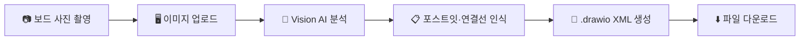

# 사용 튜토리얼 가이드

이벤트 스토밍 보드 사진을 `.drawio` 파일로 자동 변환하는 도구의 단계별 사용 가이드입니다.

## 소개

이 도구는 이벤트 스토밍 워크숍에서 작성한 포스트잇 보드 사진을 촬영하면, Vision AI가 포스트잇의 색상/텍스트/위치와 연결선을 자동으로 인식하여 draw.io에서 편집 가능한 `.drawio` 파일로 변환해 줍니다.

### 전체 흐름

```
이미지 업로드 → Vision AI 분석 → JSON 파싱 → mxGraph XML 생성 → .drawio 다운로드
```



웹 모드(브라우저)와 CLI 모드(터미널) 두 가지 방식을 제공합니다.

---

## 1. 사전 준비

### Java 17+ 설치 확인

터미널에서 Java 버전을 확인합니다.

```bash
java -version
```

`java version "17.x.x"` 이상이 출력되어야 합니다. 설치되어 있지 않다면 [Adoptium](https://adoptium.net/) 또는 [Oracle JDK](https://www.oracle.com/java/technologies/downloads/)에서 설치하세요.

### API Key 발급

Vision AI를 사용하기 위해 API Key가 필요합니다. **두 Provider 중 하나만** 선택하면 됩니다.

| Provider | 발급 링크 | 환경변수 이름 |
|----------|-----------|---------------|
| Claude (Anthropic) | [Anthropic Console](https://console.anthropic.com/) | `ANTHROPIC_API_KEY` |
| Gemini (Google AI) | [Google AI Studio](https://aistudio.google.com/apikey) | `GOOGLE_AI_API_KEY` |

> **참고:** 기본 AI Provider는 Claude입니다. Gemini를 사용하려면 별도 환경변수 설정이 필요합니다 (아래 [AI Provider 전환](#5-ai-provider-전환) 참고).

### 프로젝트 빌드

프로젝트 루트 디렉토리에서 빌드합니다.

```bash
./gradlew build
```

빌드가 성공하면 `build/libs/event-storming-drawio-0.0.1-SNAPSHOT.jar` 파일이 생성됩니다.

---

## 2. 웹 모드 튜토리얼

브라우저 기반 UI를 통해 이미지를 업로드하고 결과를 확인하는 방법입니다.

### Step 1: 서버 실행

**Claude 사용 (기본값)**

```bash
ANTHROPIC_API_KEY=sk-ant-your-key ./gradlew bootRun
```

**Gemini 사용**

```bash
AI_PROVIDER=gemini GOOGLE_AI_API_KEY=AIza-your-key ./gradlew bootRun
```

서버가 정상 시작되면 터미널에 다음과 유사한 로그가 출력됩니다:

```
Started EventStormingDrawioApplication in X.XX seconds
```

### Step 2: 브라우저 접속

웹 브라우저에서 다음 주소로 접속합니다.

```
http://localhost:8080
```

메인 페이지에 이미지 업로드 영역과 색상 매핑 설정이 표시됩니다.

### Step 3: 이미지 업로드

이미지를 업로드하는 두 가지 방법이 있습니다:

- **드래그 앤 드롭:** 이미지 파일을 업로드 영역으로 끌어다 놓기
- **클릭:** 업로드 영역을 클릭하여 파일 선택 대화상자에서 선택

**지원 형식 및 제한:**

| 항목 | 값 |
|------|---|
| 지원 형식 | PNG, JPG(JPEG), WEBP |
| 최대 파일 크기 | 20MB |

업로드 후 이미지 미리보기가 표시됩니다. 잘못 선택했다면 **"제거"** 버튼으로 다시 선택할 수 있습니다.

### Step 4: 색상 매핑 커스터마이징 (선택사항)

메인 페이지 하단의 **"색상 매핑 설정"** 영역에서 각 색상에 연결된 포스트잇 유형을 변경할 수 있습니다.

예를 들어, 워크숍에서 파란색을 "커맨드" 대신 "도메인 이벤트"로 사용했다면 드롭다운에서 변경하세요.

기본 매핑은 [색상 매핑 레퍼런스](#6-색상-매핑-레퍼런스)를 참고하세요.

### Step 5: 분석 실행

**"분석 시작"** 버튼을 클릭합니다. AI가 이미지를 분석하는 동안 로딩 스피너가 표시됩니다.

> 분석은 이미지 크기와 포스트잇 수에 따라 수 초에서 수십 초까지 소요될 수 있습니다.

### Step 6: 결과 확인

분석이 완료되면 다음 정보가 표시됩니다:

- **요약:** 인식된 포스트잇 수, 연결선 수
- **포스트잇 목록 테이블:** 각 포스트잇의 ID, 텍스트, 유형, 색상, 위치 정보
- **다운로드/복사 버튼**

### Step 7: 결과물 내보내기

- **`.drawio 파일 다운로드`** 버튼: draw.io에서 바로 열 수 있는 파일 다운로드
- **`XML 복사`** 버튼: 생성된 XML을 클립보드에 복사
- **`생성된 XML 미리보기`** 토글: 원본 XML 내용 확인

---

## 3. CLI 모드 튜토리얼

터미널에서 직접 실행하는 방법입니다. 자동화 스크립트나 CI 파이프라인에 통합할 때 유용합니다.

### 기본 실행

```bash
java -jar build/libs/event-storming-drawio-0.0.1-SNAPSHOT.jar \
  --spring.profiles.active=cli \
  --image=board.jpg
```

### 옵션 설명

| 옵션 | 필수 | 설명 | 예시 |
|------|:----:|------|------|
| `--spring.profiles.active=cli` | O | CLI 모드 활성화 | - |
| `--image` | O | 이미지 파일 경로 (png, jpg, webp) | `--image=photos/board.png` |
| `--output` | X | 출력 파일 경로 (미지정 시 이미지명.drawio) | `--output=result.drawio` |
| `--mapping` | X | 커스텀 색상 매핑 | `--mapping="orange:COMMAND,blue:DOMAIN_EVENT"` |

> **참고:** AI Provider는 환경변수로 설정합니다 (웹 모드와 동일).

### 실행 예시

**기본 실행 (Claude, 출력 파일명 자동 생성)**

```bash
ANTHROPIC_API_KEY=sk-ant-your-key \
java -jar build/libs/event-storming-drawio-0.0.1-SNAPSHOT.jar \
  --spring.profiles.active=cli \
  --image=workshop_board.jpg
```

출력: `workshop_board.drawio`

**Gemini + 커스텀 매핑 + 출력 경로 지정**

```bash
AI_PROVIDER=gemini GOOGLE_AI_API_KEY=AIza-your-key \
java -jar build/libs/event-storming-drawio-0.0.1-SNAPSHOT.jar \
  --spring.profiles.active=cli \
  --image=board.png \
  --output=output/my_board.drawio \
  --mapping="orange:COMMAND,blue:DOMAIN_EVENT,yellow:POLICY"
```

### 출력 결과 해석

실행 성공 시 다음과 같은 메시지가 출력됩니다:

```
이미지 분석 시작: board.jpg
변환 완료! 포스트잇: 12개, 연결선: 8개
출력 파일: board.drawio
```

- **포스트잇 N개:** AI가 인식한 포스트잇의 총 수
- **연결선 N개:** 포스트잇 간 연결 화살표의 수
- **출력 파일:** 생성된 `.drawio` 파일 경로

---

## 4. 커스텀 색상 매핑 문법 (CLI)

`--mapping` 옵션의 형식은 `색상이름:타입` 쌍을 쉼표로 구분합니다.

```
--mapping="색상1:타입1,색상2:타입2,색상3:타입3"
```

**사용 가능한 타입:**

| 타입 값 | 한글명 |
|---------|--------|
| `DOMAIN_EVENT` | 도메인 이벤트 |
| `COMMAND` | 커맨드 |
| `AGGREGATE` | 애그리거트 |
| `POLICY` | 정책 |
| `EXTERNAL_SYSTEM` | 외부 시스템 |
| `READ_MODEL` | 읽기 모델 |

**예시:** 주황색을 커맨드로, 파란색을 도메인 이벤트로 매핑

```bash
--mapping="orange:COMMAND,blue:DOMAIN_EVENT"
```

> 잘못된 타입 값을 입력하면 경고 로그가 출력되고 해당 매핑은 무시됩니다.

---

## 5. AI Provider 전환

### 환경변수 설정

| 환경변수 | 설명 | 값 |
|----------|------|----|
| `AI_PROVIDER` | AI Provider 선택 | `claude` (기본값) 또는 `gemini` |
| `ANTHROPIC_API_KEY` | Claude API Key | `sk-ant-...` |
| `GOOGLE_AI_API_KEY` | Gemini API Key | `AIza...` |

Claude를 사용할 때는 `AI_PROVIDER`를 설정하지 않아도 됩니다 (기본값).

```bash
# Claude (기본값 - AI_PROVIDER 생략 가능)
ANTHROPIC_API_KEY=sk-ant-your-key ./gradlew bootRun

# Gemini
AI_PROVIDER=gemini GOOGLE_AI_API_KEY=AIza-your-key ./gradlew bootRun
```

### Claude vs Gemini 비교

| 항목 | Claude | Gemini |
|------|--------|--------|
| 모델 | claude-sonnet-4-20250514 | gemini-2.0-flash |
| 설정값 | `claude` | `gemini` |
| API Key 환경변수 | `ANTHROPIC_API_KEY` | `GOOGLE_AI_API_KEY` |
| 특징 | 정밀한 텍스트 인식 | 빠른 응답 속도 |

---

## 6. 색상 매핑 레퍼런스

### 기본 색상-타입 매핑

| 색상 | Hex 코드 | PostIt 타입 | 한글명 |
|------|----------|-------------|--------|
| orange | `#FF8C00` | `DOMAIN_EVENT` | 도메인 이벤트 |
| blue | `#4A90D9` | `COMMAND` | 커맨드 |
| yellow | `#FFD700` | `AGGREGATE` | 애그리거트 |
| purple | `#9B59B6` | `POLICY` | 정책 |
| pink | `#FF69B4` | `EXTERNAL_SYSTEM` | 외부 시스템 |
| green | `#2ECC71` | `READ_MODEL` | 읽기 모델 |

### PostItType 열거형

| 열거값 | 한글명 | 배경색 | 글자색 |
|--------|--------|--------|--------|
| `DOMAIN_EVENT` | 도메인 이벤트 | `#FF8C00` | `#FFFFFF` |
| `COMMAND` | 커맨드 | `#4A90D9` | `#FFFFFF` |
| `AGGREGATE` | 애그리거트 | `#FFD700` | `#333333` |
| `POLICY` | 정책 | `#9B59B6` | `#FFFFFF` |
| `EXTERNAL_SYSTEM` | 외부 시스템 | `#FF69B4` | `#FFFFFF` |
| `READ_MODEL` | 읽기 모델 | `#2ECC71` | `#FFFFFF` |
| `UNKNOWN` | 알 수 없음 | `#CCCCCC` | `#333333` |

> 웹 UI에서는 메인 페이지의 색상 매핑 설정 영역에서 드롭다운으로 변경할 수 있습니다.

---

## 7. draw.io에서 결과 열기

### draw.io Desktop

1. [draw.io Desktop](https://github.com/jgraph/drawio-desktop/releases)을 설치합니다.
2. 다운로드한 `.drawio` 파일을 더블클릭하거나, draw.io에서 **File > Open**으로 엽니다.

### draw.io Web

1. [app.diagrams.net](https://app.diagrams.net)에 접속합니다.
2. **File > Open from > Device**를 선택하고 `.drawio` 파일을 업로드합니다.

### 결과물 편집 팁

- 포스트잇 위치가 겹치면 **드래그**로 재배치하세요.
- 연결선이 부정확하면 선택 후 삭제하고 새로 그릴 수 있습니다.
- **File > Export as**로 PNG, SVG, PDF 등 다양한 형식으로 내보낼 수 있습니다.
- draw.io의 **Auto Layout** 기능(Format > Layout)으로 자동 정렬을 시도해 보세요.

---

## 8. 문제 해결 (FAQ)

### 지원되지 않는 이미지 형식 오류

**지원 형식:** PNG, JPG(JPEG), WEBP만 지원합니다.

다른 형식(HEIC, BMP, TIFF 등)은 변환 후 업로드하세요.

### 파일 크기 초과 오류

최대 업로드 크기는 **20MB**입니다. 이미지 크기를 줄이거나 압축한 후 다시 시도하세요.

### API Key 미설정 오류

```
API key is missing or invalid
```

- 환경변수가 올바르게 설정되었는지 확인하세요.
- Claude 사용 시: `ANTHROPIC_API_KEY` 환경변수
- Gemini 사용 시: `AI_PROVIDER=gemini`와 `GOOGLE_AI_API_KEY` 환경변수 모두 필요

### AI 분석 정확도 향상 팁

사진 품질이 분석 결과에 큰 영향을 줍니다. 다음 사항을 참고하세요:

- **정면에서 촬영:** 비스듬한 각도보다 보드 정면에서 촬영하세요.
- **충분한 조명:** 포스트잇 색상이 선명하게 보이도록 조명을 확보하세요.
- **글씨 선명도:** 포스트잇에 적힌 텍스트가 읽힐 수 있도록 충분한 해상도로 촬영하세요.
- **반사 방지:** 화이트보드나 유리 표면의 빛 반사를 피하세요.
- **한 번에 전체 보드:** 보드 전체가 한 프레임에 들어오도록 촬영하세요.

### 이미지 파일을 찾을 수 없음 (CLI)

```
이미지 파일을 찾을 수 없습니다: board.jpg
```

`--image` 옵션에 전달한 경로가 정확한지 확인하세요. 상대 경로와 절대 경로 모두 사용 가능합니다.
